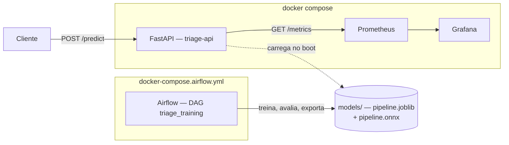

# triage


Triagem automática de laudos médicos com NLP, servida via FastAPI, com
treino/retreino orquestrado por Airflow, observabilidade via
Prometheus/Grafana e um backend de inferência otimizado em ONNX Runtime.

## O problema

Classificação automática de resumos de laudos médicos (abstracts) em uma
de cinco categorias clínicas, com o objetivo de apoiar a priorização e o
roteamento inicial de casos em um fluxo de triagem — reduzir o tempo entre
a chegada de um laudo e a decisão de quem atender primeiro.

> **O nível de urgência derivado da condição prevista
> (`normal`/`atencao`/`urgente`, ver `src/triage/urgency.py`) é uma
> heurística de produto, não um rótulo clínico validado.** O sistema é uma
> ferramenta de apoio à priorização e **não substitui a avaliação de um
> profissional de saúde**. Ver `docs/model_card.md` para a discussão
> completa de limitações e considerações éticas.

## Dataset

Baseado no **Medical Abstracts TC Corpus**, abstracts de artigos científicos
em inglês rotulados em 5 classes de condição clínica:

1. neoplasms
2. digestive system diseases
3. nervous system diseases
4. cardiovascular diseases
5. general pathological conditions

O corpus é de literatura científica, não de laudos hospitalares reais — há
um descasamento de domínio real entre o que o modelo viu no treino e um
laudo de pronto-socorro (ver `docs/model_card.md`, seção de limitações).

Os arquivos CSV (`data/medical_tc_train.csv`, `data/medical_tc_test.csv`,
`data/medical_tc_labels.csv`) não são versionados no repositório — devem
ser obtidos separadamente e colocados em `data/`.

## Arquitetura

Componentes locais (o que este repositório efetivamente executa):



A decisão de arquitetura em **nuvem** está documentada por completo em
[`docs/deploy_architecture.md`](docs/deploy_architecture.md); em resumo: a
recomendação é servir o modelo em **tempo real** (não em lote), porque o
valor clínico da triagem depende de responder no momento do atendimento —
um pipeline batch entregaria a priorização depois que a decisão humana já
foi tomada. A arquitetura proposta é **ALB → ECS Fargate** (2+ tasks,
autoscaling por CPU e por latência do target group) para o serviço de
inferência, com artefatos versionados em **S3** e imagens no **ECR**;
**MWAA** (ou Airflow em Fargate) executa o retreino e publica o novo
artefato; **Amazon Managed Prometheus/Grafana** cobre a observabilidade.
Nenhuma dessas alternativas de nuvem foi provisionada — é uma decisão
documentada, não um ambiente em produção.

## Como executar

### Pré-requisitos

- Python 3.10
- [Poetry](https://python-poetry.org/) 2.x
- Docker e Docker Compose

### Treino e exportação do modelo

```bash
make install          # instala dependências
make train            # gera models/pipeline.joblib e models/metadata.json
make export-onnx      # gera models/pipeline.onnx a partir do pipeline treinado
```

### Serviço de inferência + observabilidade

```bash
make up                # sobe API + Prometheus + Grafana (docker compose)
```

O serviço usa o backend `onnx` por padrão, então `make export-onnx` (acima)
precisa ter rodado antes de `make up` — sem `models/pipeline.onnx` a API
sobe em modo degradado. Para comparar com o backend original, use
`TRIAGE_BACKEND=sklearn make up`.

| Serviço | URL | Credenciais |
|---|---|---|
| API (Swagger UI) | http://localhost:8000/docs | — |
| Prometheus | http://localhost:9090 | — |
| Grafana | http://localhost:3000 | `admin` / `admin` |

```bash
make load-test          # gera tráfego de teste contra a API (500 requisições)
make down               # derruba o compose
```

O backend de inferência é escolhido pela variável `TRIAGE_BACKEND`
(`sklearn` ou `onnx`, padrão `onnx` — ver `docker-compose.yml` e
`docs/latency_report.md` para a comparação entre os dois).

### Orquestração de treino (Airflow)

```bash
mkdir -p airflow/logs
make airflow-up
```

| Serviço | URL | Credenciais |
|---|---|---|
| Airflow | http://localhost:8080 | `admin` / `admin` |

```bash
make airflow-down
```

A DAG `triage_training` (`validate_data → load_data → train_model →
evaluate_model → export_onnx → register_artifacts`) fica visível já
**despausada** (`is_paused_upon_creation=False`) — uma DAG nova do Airflow
nasce pausada por padrão, e uma execução disparada contra uma DAG pausada
fica presa em `queued` silenciosamente, sem erro visível. Se este ambiente
já tiver a DAG registrada de uma execução anterior a essa correção, ela
pode continuar pausada mesmo assim (a opção não é retroativa) — nesse
caso, despause manualmente pela UI antes de disparar uma run.

## Resultados

### Latência (`predictor.predict()`, ver `docs/latency_report.md` para a metodologia completa)

| Backend | p50 single (ms) | p50 batch de 32 (ms) | artefato |
|---|---|---|---|
| sklearn | 0.80 | 6.83 | 6.0 MB |
| onnx | 0.26 | 12.85 | 2.7 MB |

O ONNX ganha ~3.1x no p50 de requisição única (o caso do endpoint
`/predict`), mas fica mais lento que o sklearn em lotes de 32 documentos —
resultado misto, reportado sem maquiagem em
[`docs/latency_report.md`](docs/latency_report.md), que também mostra o
baseline HTTP fim a fim medido em Docker na Etapa 1 (p50 6.4 ms, p95 8.4 ms,
p99 8.9 ms) e a paridade entre backends (100% de concordância de classe,
diferença máxima de probabilidade de 2.813e-07 sobre o held-out completo).

### Qualidade do modelo

Held-out (`medical_tc_test.csv`, 2.770 documentos após limpeza):
**macro-F1 0.5900**, **acurácia 0.5874**. Detalhamento por classe, matriz
de confusão e discussão de limitações em
[`docs/model_card.md`](docs/model_card.md).

### Dashboard Grafana

Para reproduzir o dashboard localmente: `make up` → `make load-test` →
abrir `http://localhost:3000` (`admin`/`admin`, pasta **Triagem**) com
tráfego real passando pelos 5 painéis. Uma captura desse dashboard pode ser
salva em `docs/img/grafana-dashboard.png` e referenciada aqui com
``.

## Estrutura do projeto

```
.
├── airflow/dags/triage_training_dag.py   # DAG de treino/retreino
├── configs/params.yaml                   # hiperparâmetros e gate de qualidade
├── dashboards/grafana/                   # dashboard provisionado (5 painéis)
├── docker/                               # Dockerfile da API + config Prometheus
├── docs/                                 # relatórios e decisões desta entrega
│   ├── deploy_architecture.md            # decisão de arquitetura em nuvem
│   ├── latency_report.md                 # comparação sklearn vs. ONNX
│   ├── model_card.md                     # dados, métricas, limitações
│   ├── latency_results.json              # saída bruta de `make benchmark`
│   └── roteiro_video.md                  # roteiro STAR do vídeo
├── notebooks/01_eda.ipynb                # EDA + comparação de modelos
├── scripts/
│   ├── train.py                          # treino e comparação de candidatos
│   ├── export_onnx.py                    # exporta o pipeline para ONNX
│   ├── benchmark_latency.py              # benchmark de latência + paridade
│   └── generate_load.py                  # gerador de carga para `make load-test`
├── src/triage/
│   ├── api/                              # FastAPI + métricas Prometheus
│   ├── config/                           # settings e seed globais
│   ├── data/                             # carga/limpeza/validação do corpus
│   ├── features/                         # vetorização TF-IDF
│   ├── inference/                        # backends sklearn e ONNX
│   ├── models/                           # pipeline, treino, avaliação, persistência
│   └── urgency.py                        # heurística de urgência
└── tests/                                # espelha a estrutura de src/triage
```
