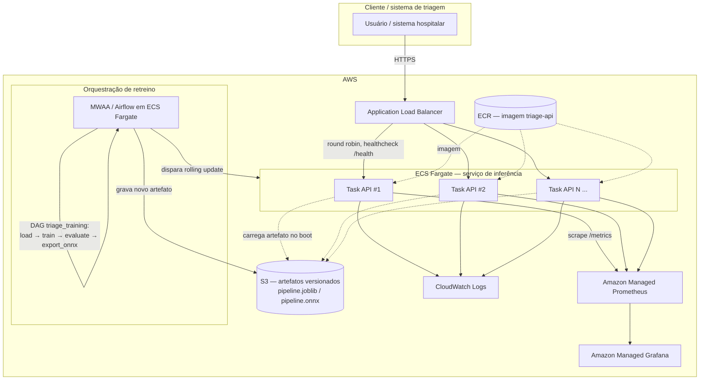

# Decisão de arquitetura em nuvem

Este documento registra a decisão de arquitetura de implantação em nuvem
exigida pela Etapa 1 do Tech Challenge. **Nenhuma infraestrutura AWS foi
provisionada neste projeto** — o entregável desta etapa é a decisão
documentada e justificada, não um ambiente em produção. O que roda de fato
está descrito no `README.md` (`docker compose`, local).

## 1. Batch vs. tempo real

**Recomendação: inferência em tempo real (online), via API síncrona.**

O valor clínico da triagem está em priorizar o atendimento *no momento em
que o laudo chega* — uma fila de casos que já esperou uma janela de
processamento batch (por exemplo, um job noturno) já perdeu a oportunidade
de reordenar o atendimento por urgência: a decisão humana sobre quem atender
primeiro já foi tomada, com ou sem o apoio do modelo. Latência de segundos,
não de horas, é o requisito que faz o sistema útil.

Processamento em lote (batch) continua tendo um papel, mas fora do caminho
crítico de decisão:

- **Reprocessamento histórico** — reclassificar um acervo de laudos já
  atendidos, para auditoria, análise agregada ou geração de métricas de
  produto.
- **Retreino periódico** — a DAG do Airflow (`triage_training`, ver
  `airflow/dags/triage_training_dag.py`) roda em lote, por definição: ela
  não participa da resposta a uma requisição de triagem, e sim da atualização
  do modelo que serve essas requisições.

## 2. Arquitetura proposta em AWS

**Componentes:**

- **ALB** — ponto de entrada HTTPS; distribui o tráfego entre as tasks e
  usa `GET /health` como healthcheck.
- **ECS Fargate** — roda a mesma imagem construída localmente
  (`docker/Dockerfile`), com 2 ou mais tasks para evitar ponto único de
  falha durante deploy.
- **S3 versionado** — guarda `pipeline.joblib`, `pipeline.onnx` e
  `metadata.json`. Cada task carrega o artefato no boot; o versionamento
  permite voltar a um modelo anterior sem retreinar.
- **ECR** — registro das imagens Docker, versionadas por tag/commit.
- **MWAA (ou Airflow em ECS Fargate)** — executa a mesma DAG
  `triage_training`, sem mudança de código. O gate de qualidade
  (`min_macro_f1` em `configs/params.yaml`) impede a publicação de um
  modelo pior; se aprovado, o artefato vai para o S3 e as tasks do ECS são
  reiniciadas para carregá-lo.
- **Amazon Managed Prometheus + Managed Grafana** — equivalentes
  gerenciados da stack local; o dashboard em
  `dashboards/grafana/triage-dashboard.json` pode ser importado sem
  alterações.
- **CloudWatch Logs** — logs das tasks Fargate.

## 3. Alternativas descartadas

- **AWS Lambda** — `onnxruntime`, `scikit-learn` e `scipy` juntos estouram
  o limite de pacote da Lambda, e a alternativa (Lambda com contêiner)
  traz cold start de segundos, inaceitável para triagem em tempo real.
- **SageMaker Endpoint** — pensado para modelos pesados (GPU, deep
  learning, múltiplas versões). É desproporcional para um modelo linear de
  2.7 MB que responde em milissegundos numa CPU comum.
- **EC2** — exigiria gerenciar sistema operacional, load balancer e
  healthchecks manualmente, sem ganho sobre o Fargate para este caso.
