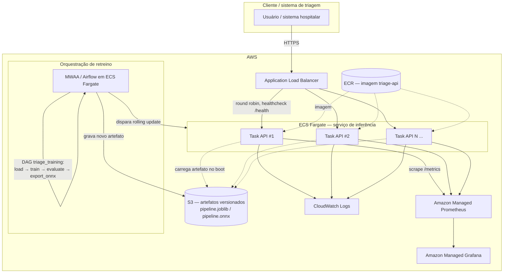

# Decisão de arquitetura em nuvem

Este documento registra a decisão de arquitetura de implantação em nuvem
exigida pela Etapa 1 do Tech Challenge. **Nenhuma infraestrutura AWS foi
provisionada neste projeto** — o entregável desta etapa é a decisão
documentada e justificada, não um ambiente em produção. O que roda de fato
está descrito no `README.md` (`docker compose`, local).

## 1. Batch vs. tempo real

**Recomendação: inferência em tempo real (online), via API síncrona.**

O valor clínico da triagem está em priorizar o atendimento *no momento em
que o laudo chega* — uma fila de casos que já esperou uma janela de
processamento batch (por exemplo, um job noturno) já perdeu a oportunidade
de reordenar o atendimento por urgência: a decisão humana sobre quem atender
primeiro já foi tomada, com ou sem o apoio do modelo. Latência de segundos,
não de horas, é o requisito que faz o sistema útil.

Processamento em lote (batch) continua tendo um papel, mas fora do caminho
crítico de decisão:

- **Reprocessamento histórico** — reclassificar um acervo de laudos já
  atendidos, para auditoria, análise agregada ou geração de métricas de
  produto.
- **Retreino periódico** — a DAG do Airflow (`triage_training`, ver
  `airflow/dags/triage_training_dag.py`) roda em lote, por definição: ela
  não participa da resposta a uma requisição de triagem, e sim da atualização
  do modelo que serve essas requisições.

## 2. Arquitetura proposta em AWS

**Componentes:**

- **ALB (Application Load Balancer)** — ponto de entrada único, TLS
  terminado aqui, distribui tráfego entre as tasks do serviço de inferência
  e usa `GET /health` como target group healthcheck (o endpoint já existe e
  já expressa "degradado" quando o modelo não carrega — ver
  `src/triage/api/app.py`).
- **ECS Fargate (serviço da API)** — 2 ou mais tasks por padrão (evita ponto
  único de falha durante deploy), autoscaling por CPU e por latência
  observada no target group (p95 do ALB como métrica de scale-out).
  Sem servidor para gerenciar, a imagem já é a mesma `triage-api:local`
  construída localmente (`docker/Dockerfile`), publicada no ECR.
- **S3 versionado** — armazena `pipeline.joblib`/`pipeline.onnx` e
  `metadata.json`. Cada task carrega o artefato do S3 no boot (o mesmo
  padrão de "carregar no lifespan" já implementado localmente com volume
  montado, ver `src/triage/api/app.py`); o versionamento do bucket permite
  reverter para um artefato anterior sem re-treinar.
- **ECR** — registra as imagens Docker versionadas por tag/commit. A imagem
  do serviço carrega `skl2onnx` mesmo quando `TRIAGE_BACKEND=sklearn` — o
  `pipeline.joblib` foi salvo com um vetorizador
  (`TraceableTfidfVectorizer`) definido em `skl2onnx.sklapi`, então
  `joblib.load` precisa dessa classe disponível para desserializar o
  artefato, mesmo que a task nunca chegue a rodar uma conversão ONNX. É um
  custo de acoplamento aceito deliberadamente (ver `docs/model_card.md`,
  seção de limitações), não um erro de empacotamento — mas vale considerar
  ao dimensionar a imagem publicada no ECR.
- **MWAA (Managed Workflows for Apache Airflow) ou Airflow auto-hospedado em
  ECS Fargate** — executa a mesma DAG `triage_training` já implementada
  (`load_data → train_model → evaluate_model → export_onnx →
  register_artifacts`), sem mudança de código: o gate de qualidade
  (`min_macro_f1: 0.55` em `configs/params.yaml`) continua bloqueando a
  substituição do artefato em produção se o modelo novo regredir. Ao final
  de um treino bem-sucedido, grava o novo artefato no S3 e dispara um
  rolling deployment do serviço ECS (nova revisão da task definition
  apontando para o mesmo S3 URI, ou um evento que force o restart das
  tasks para recarregar o artefato).
- **Amazon Managed Service for Prometheus + Amazon Managed Grafana** —
  equivalentes gerenciados do par Prometheus/Grafana já rodando localmente
  via `docker-compose.yml`; o dashboard versionado em
  `dashboards/grafana/triage-dashboard.json` é importável diretamente no
  Managed Grafana, sem reescrever painéis.
- **CloudWatch Logs** — captura os logs estruturados (`logging`, nunca
  `print`, já é a convenção do código) emitidos pelas tasks Fargate.

## 3. Alternativas descartadas

- **AWS Lambda** — descartada. O pacote de dependências do serviço inclui
  `onnxruntime`, cujo binário nativo (mesmo a variante CPU) já consome uma
  fatia significativa do limite de tamanho de pacote/camada da Lambda
  quando somado a `scikit-learn`, `scipy` e `pandas`; na prática, o pacote
  estoura o limite prático de deployment sem recorrer a contêineres Lambda
  dedicados, que por sua vez reintroduzem cold start. E cold start é
  exatamente o que compromete a métrica que mais importa aqui: o p99, que
  já é sensível o bastante no baseline medido (Etapa 1, Task 7) para que
  adicionar uma inicialização de alguns segundos ocasionalmente seja
  inaceitável para triagem em tempo real.
- **SageMaker Endpoint** — descartada. É a ferramenta certa para modelos
  pesados (deep learning, GPU, múltiplas versões em produção com shadow
  testing automatizado), mas o custo fixo de um endpoint SageMaker dedicado
  e o overhead operacional de sua camada de orquestração são
  desproporcionais para um modelo linear de poucos megabytes
  (`pipeline.onnx`: 2.7 MB) que já roda em milissegundos em uma CPU comum —
  não há necessidade de GPU, autoscaling de modelo multi-versão, nem das
  demais features que justificam o preço do serviço.
- **EC2 gerenciado manualmente** — descartada. Exigiria manter patch de SO,
  scaling manual ou via Auto Scaling Group configurado à mão, e
  provisionamento de load balancer e healthchecks que o ECS Fargate já
  oferece nativamente, sem ganho de desempenho ou de controle que justifique
  o esforço operacional adicional para este workload.

## 4. Custo estimado

Estimativa aproximada, mensal, para um serviço de baixo a médio tráfego
(ordem de dezenas de milhares de requisições/dia), preços de referência
`us-east-1`:

| Componente | Configuração de referência | Custo aproximado/mês |
|---|---|---|
| ECS Fargate (API) | 2 tasks × 0.5 vCPU / 1 GB, 24/7 | ~US$ 30–40 |
| ALB | 1 balanceador + tráfego baixo | ~US$ 20 |
| S3 | poucos GB de artefatos versionados | < US$ 1 |
| ECR | poucas imagens, storage baixo | < US$ 1 |
| MWAA (ambiente `mw1.small`) | 1 ambiente, uso semanal (retreino `@weekly`) | ~US$ 250–300 |
| Amazon Managed Prometheus | volume baixo de séries | ~US$ 20–40 |
| Amazon Managed Grafana | 1–2 usuários editores | ~US$ 9–18 |
| CloudWatch Logs | volume baixo, retenção curta | ~US$ 5–10 |

**Total aproximado: US$ 350–430/mês.** O item dominante é o MWAA — para um
retreino semanal, um Airflow auto-hospedado em ECS Fargate (mesma imagem,
subindo sob demanda ou como um serviço permanente de baixo custo) é a
alternativa mais barata caso o custo do MWAA gerenciado não se justifique
para a frequência de retreino do projeto; a troca é operacional (gerenciar
o próprio Airflow) por financeira. Estes números são estimativas de ordem
de grandeza para orçamento, não uma cotação — dependem de tráfego real,
região e descontos contratuais.

## 5. Estratégia de escala

- **Escala horizontal do serviço de inferência**: ECS Fargate com
  autoscaling por CPU (target tracking, ex.: 60%) e por latência do target
  group do ALB (scale-out se o p95 observado pelo ALB ultrapassar um limiar,
  ex.: 200 ms) — cobre tanto aumento de volume de requisições quanto
  degradação de latência sob carga, sem depender de uma única métrica.
- **Sem estado no serviço**: cada task carrega o artefato do S3 no boot e
  não mantém estado de sessão entre requisições — escalar horizontalmente
  não exige coordenação entre tasks.
- **Retreino desacoplado do serviço**: a DAG de retreino roda em sua própria
  infraestrutura (MWAA/Fargate separado), então picos de tráfego na API não
  competem por recursos com o treino, e um treino longo não degrada a
  latência de quem está sendo atendido.
- **Rollout do modelo sem downtime**: publicar um novo artefato no S3 e
  disparar um rolling deployment das tasks ECS (uma de cada vez, com
  healthcheck) evita interromper o serviço durante a atualização do modelo;
  o versionamento do bucket permite reverter rapidamente se o novo artefato
  se comportar mal em produção, sem precisar re-treinar o anterior.
